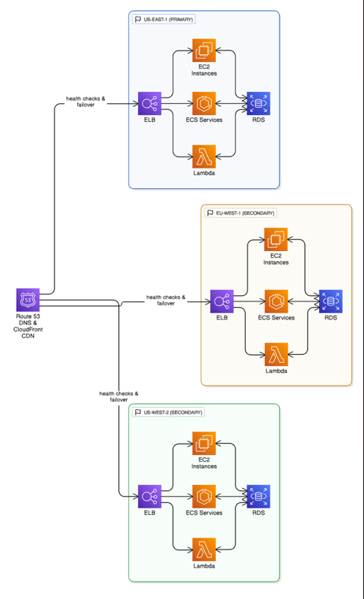

# AWS DNS Outage Prevention and Resilience System

## Introduction

This project provides a comprehensive system for preventing DNS-related outages and ensuring multi-region resilience for AWS infrastructure. It is designed to proactively monitor critical AWS service endpoints, detect DNS resolution failures, and automate failover procedures to maintain high availability. The system includes a real-time web dashboard for at-a-glance monitoring and detailed analysis of service health.

## Key Features

### DNS Outage Prevention
- **Real-Time DNS Monitoring**: Continuously checks the DNS resolution of critical AWS service endpoints (DynamoDB, RDS, Lambda, EC2, ELB, S3) across multiple regions.
- **Cascade Failure Prevention**: Identifies and mitigates the risk of cascade failures by monitoring service dependencies and analyzing the potential impact of a DNS failure.
- **Automated Response**: Triggers automated responses to DNS failures, including scaling actions, failover procedures, and notifications.

### Multi-Region Resilience
- **Automated Failover**: Automatically switches traffic between primary and secondary regions in the event of an outage.
- **Health Checks**: Performs comprehensive health checks on all services in each region to determine the optimal failover target.
- **DNS and CDN Updates**: Updates Route 53 DNS records and CloudFront distributions to redirect traffic to the healthy region.

### Live Monitoring and Visualization
- **Web Dashboard**: A real-time, responsive web dashboard provides a comprehensive view of system health, including multi-region status, service health matrix, and detailed endpoint information.
- **CloudWatch Dashboards**: Creates detailed CloudWatch dashboards in the AWS Console for at-a-glance monitoring of DNS health, cascade risk, and service dependencies.
- **Custom Metrics and Alarms**: Publishes custom CloudWatch metrics for DNS success rate, response time, and overall system health, and configures alarms to trigger on critical thresholds.

## Architecture

The system is designed for high availability and multi-region resilience. The following diagram illustrates the architecture:



<p align="center">*Figure 1: High Level Architecture Diagram.*</p>

## Service Architecture Breakdown

This section provides a detailed look into how each AWS service and core technology is utilized within the system to achieve its resilience and monitoring goals.

### Core AWS Services for Resilience and Monitoring

1.  **Amazon Route 53**
    *   **Usage:** Route 53 is used as the primary mechanism for DNS management and failover. The `multi_region_failover.py` script directly interacts with the Route 53 API. During a failover event, the system automatically updates DNS records (specifically 'A' or 'CNAME' records) to change the endpoint from the failing primary region to the healthy secondary region. This reroutes user traffic at the DNS level.

2.  **Amazon CloudFront**
    *   **Usage:** CloudFront serves as a global content delivery network (CDN) and a critical layer for rapid traffic redirection. It sits in front of the application's resources (like load balancers). The key function, found in `multi_region_failover.py`, is `_update_cloudfront_origins`. When a failover is triggered, this function programmatically changes the "origin" of the CloudFront distribution to the load balancer in the healthy region. This is often faster and more seamless than waiting for DNS changes to propagate globally.

3.  **AWS CloudWatch**
    *   **Usage:** CloudWatch is the central hub for monitoring, logging, and alarms.
        *   **Dashboards:** The `live_dashboard.py` script is dedicated to programmatically creating comprehensive CloudWatch dashboards. These dashboards visualize critical metrics like DNS success rates, response times, cascade failure risk, and overall system health, providing an at-a-glance view directly in the AWS Console.
        *   **Metrics:** The system publishes custom metrics to CloudWatch, such as `DNSSuccessRate`, `OverallDNSHealth`, and `CascadeRiskScore`. This allows for tracking the system's specific performance indicators.
        *   **Alarms:** The system configures CloudWatch alarms that trigger when these custom metrics cross predefined critical thresholds (e.g., if DNS success rate drops below 90%). These alarms can then initiate automated responses or notifications.

4.  **AWS Lambda**
    *   **Usage:** The `deployment_script.py` provisions Lambda functions that are the "brains" of the monitoring system. These functions are designed to run the logic from scripts like `enhanced_dns_monitor.py`. They execute periodically to perform the DNS health checks against other services (like DynamoDB and RDS), collect metrics, and publish them to CloudWatch. This serverless approach is efficient and scalable.

5.  **AWS EventBridge (formerly CloudWatch Events)**
    *   **Usage:** EventBridge is the scheduler for the system. The deployment script sets up EventBridge rules that trigger the monitoring Lambda functions on a fixed schedule (e.g., every one minute). This ensures that the health checks are performed continuously and automatically without manual intervention.

### Monitored AWS Services

The system is designed to monitor the health and DNS resolvability of the following critical services to prevent outages:

6.  **Amazon EC2 (Elastic Compute Cloud)**
    *   **Usage:** The health check functions in `multi_region_failover.py` (`_check_ec2_health`) monitor the status of EC2 instances. It checks if instances are in a 'running' state and if their system and instance status checks are 'ok'. An application's health is often dependent on its underlying virtual servers being operational.

7.  **Amazon ELB (Elastic Load Balancing)**
    *   **Usage:** ELB health is monitored via the `_check_elb_health` function. The system checks the state of the load balancers and, more importantly, the health of the targets registered with them. A healthy load balancer is essential for distributing traffic effectively to the backend EC2 instances or containers.

8.  **Amazon RDS (Relational Database Service)**
    *   **Usage:** The system checks the status of RDS database instances using the `_check_rds_health` function. It ensures that the database instances are in an 'available' state, which is critical for any application that relies on a relational database.

9.  **Amazon ECS (Elastic Container Service)**
    *   **Usage:** For applications running on containers, the `_check_ecs_health` function monitors the health of ECS clusters and the services running within them. It verifies that clusters are 'ACTIVE' and that the desired number of tasks for each service is running.

10. **Amazon DynamoDB & Amazon S3**
    *   **Usage:** Unlike the services above, DynamoDB and S3 are fully managed services with regional endpoints. The `enhanced_dns_monitor.py` script focuses on performing DNS resolution checks against these endpoints. The goal is to detect if the application can correctly resolve the DNS names for these critical services, as a failure to do so was the root cause of major past outages.

### Deployment and Infrastructure as Code (IaC)

11. **AWS CloudFormation**
    *   **Usage:** The project uses CloudFormation templates (`resilience_architecture.yaml`) to define and provision the core, foundational AWS infrastructure. This includes networking components like the VPC, subnets, and security groups, as well as the ECS cluster. Using IaC ensures the environment is repeatable, consistent, and version-controlled.

12. **AWS IAM (Identity and Access Management)**
    *   **Usage:** Security is managed via IAM. The `deployment_script.py` creates specific IAM roles and policies that grant the Lambda functions and other system components the exact permissions they need to interact with other AWS services (e.g., permissions to read EC2 status, publish CloudWatch metrics, update Route 53). This adheres to the principle of least privilege.

### Core Technologies

13. **Python**
    *   **Usage:** Python is the programming language used for the entire application logic. All the scripts (`multi_region_failover.py`, `deployment_script.py`, etc.) are written in Python, using the **Boto3 library** as the AWS SDK to interact with the AWS services listed above.

14. **Flask**
    *   **Usage:** Flask is a Python web framework used to create the user-facing real-time monitoring dashboard. The `web_dashboard.py` script runs a Flask web server, which serves the `dashboard.html` page and provides data to it via a backend API, allowing users to see the system's status in a web browser.

15. **AWS CLI (Command Line Interface)**
    *   **Usage:** The AWS CLI is listed as a prerequisite. It's used for initial setup and configuration of the AWS environment on a developer's machine. The deployment scripts may also invoke AWS CLI commands under the hood for certain actions.

16. **Git**
    *   **Usage:** Git is used for version control of the entire codebase, enabling tracking of changes, collaboration, and maintaining a history of the project. It is fundamental to the development workflow.


## System Components

### Core Logic
- **`outage_prevention_system.py`**: The core of the DNS monitoring and outage prevention system. It performs health checks, analyzes DNS resolution, assesses cascade failure risk, and triggers automated responses.
- **`multi_region_failover.py`**: Implements the logic for automatic multi-region failover. It continuously monitors the health of primary and secondary regions and manages the failover process.

### Deployment and Configuration
- **`deployment_script.py`**: A comprehensive script that automates the deployment of the entire system, including IAM roles, Lambda functions, EventBridge rules, and CloudWatch dashboards.
- **`deploy_outage_prevention.py`**: The main entry point for deploying the system. It checks for prerequisites, installs dependencies, and executes the deployment script.
- **`cloudformation.yaml`** and **`resilience_architecture.yaml`**: CloudFormation templates that define the core AWS infrastructure, including VPC, subnets, security groups, and ECS cluster.

### Monitoring and Visualization
- **`web_dashboard.py`**: A Flask-based web application that provides the real-time monitoring dashboard.
- **`dashboard.html`**: The HTML template for the web dashboard.
- **`live_dashboard.py`**: Creates and manages the CloudWatch dashboards in the AWS Console.
- **`enhanced_dns_monitor.py`** and **`simple_dns_monitor.py`**: Terminal-based monitoring scripts for DNS health checks.
- **`launch_dashboard.py`**: A simple script to launch the web dashboard.

## Getting Started

### Prerequisites
- Python 3.7+
- AWS CLI
- Configured AWS credentials

### Deployment
1. **Clone the repository:**
   ```bash
   git clone <repository-url>
   cd <repository-directory>
   ```
2. **Run the deployment script:**
   ```bash
   python deploy_outage_prevention.py
   ```
   This will guide you through the deployment process, which includes installing dependencies and provisioning the necessary AWS resources.

### Accessing the Dashboard
Once the deployment is complete, you can access the web dashboard by running:
```bash
python launch_dashboard.py
```
This will start the web server and open the dashboard in your default browser at `http://localhost:5000`.

## Configuration

The system can be configured through environment variables and by modifying the Python scripts.

### Environment Variables
- `AWS_REGION`: The primary AWS region.
- `ENVIRONMENT`: The deployment environment (e.g., `production`, `staging`).

### Custom Thresholds
The failover thresholds can be customized in `multi_region_failover.py`:
- `health_threshold`: The minimum health score for a region to be considered healthy.
- `response_time_threshold`: The maximum response time for health checks.
- `consecutive_failures_threshold`: The number of consecutive failures before triggering a failover.

## Testing

The system includes functionality for simulating outage scenarios and performing load testing.

### Simulate Failover
You can test the failover mechanism by calling the `perform_failover` method in `multi_region_failover.py`:
```python
from multi_region_failover import MultiRegionFailoverManager
manager = MultiRegionFailoverManager()
manager.perform_failover('us-east-1', 'us-west-2', 'Testing')
```

### Load Testing
You can use tools like `ab` (Apache Bench) to generate traffic and test the system's scaling capabilities:
```bash
ab -n 10000 -c 100 http://your-load-balancer-dns/
```

## Contributing

Contributions are welcome. Please follow these steps:
1. Fork the repository.
2. Create a new feature branch.
3. Add tests for your new functionality.
4. Submit a pull request.
